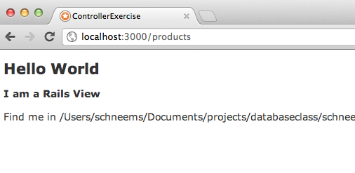

# Routes, Controllers & Views Oh My

## What?

Note directions that start with `$` indicate they are on the command line, you should not copy the `$`.

## Fork & Clone

Fork this project and then clone it to your local machine.

## Install

Once on your local machine you will need to navigate to the project directory and run

    $ rake db:create
    $ rake db:migrate

This will create a Users table and a Products table. The MVCr (Model View Controller (r)outes) for users has already been created. If you run your rails server by executing:

    $ rails server

You can then visit [localhost:3000/users/new](http://localhost:3000/users/new) in your browser and create a new user.

There is a controller for products in `app/controllers/products_controller.rb` but it is empty. There is one view for products in `app/views/products/index.html.erb` and one route to this view in `config.routes.rb`. It looks like this:

    match '/products' => 'products#index'

This means that if you visit [localhost:3000/products](http://localhost:3000/products) in your browser you will see the contents of the index view in the products folder, the one located in `app/views/products/index.html.erb`. In this exercise we will see how to add content from our database to our views, how to add information retrieved from our users to our database, and finally have a properly formatted MVCr for Products.

## 1) Populating Data

If you didn't already create a user by visiting [localhost:3000/users/new](http://localhost:3000/users/new) filling out the form and hitting submit.

In a new terminal run the rails console:

    $ rails console
    Loading development environment (Rails 3.2.6)
    >

From here we can use our rails code and populate our database and perform queries against our database. If you were able to successfully create a user you should be able to see them in the console.

(Note from now on out the character `>` denotes that we are running in the rails console. If code isn't working check that you're not still in terminal `$` and vice versa. Try not to copy and paste code, the process of typing it in will help you build up a muscle memory for the code, like learning to write a new language.)

    > User.count
    => 1
    > User.first
    => #<User id: 1, name: "richard", job_title: "professor", created_at: "2012-03-23 03:04:05", updated_at: "2012-05-14 05:23:06" >

(Note: the `#` character indicates a comment, anything after it will be ignored unless it is used inside of a string to like "the value of 1 + 1 is: #{1+1}". I will add notes about what is going on in the console following the naked `#` character. This is also how rails shows model objects when they are inspected. using #<User ...> for the User model and #<Product ... > for the Product model, etc. )

Now that you've got a user in your database lets make sure we can find them again with SQL. Take the name entered above (in this case `richard`)  and search the database for it:

    > User.where(:name => 'richard')
    => [#<User id: 1, name: "richard", ... >]

Great that found ALL of the users named 'richard', if you got an empty array try again, make sure to use the name you used. If we wanted to find only one richard, we could limit the query and pull out the first user like this:

    > User.where(:name => 'richard').first
    => #<User id: 1, name: "richard", ... >

Cool, now we can store that user to a variable to use later:

    > rich = User.where(:name => 'richard').first
    > rich.name
    => "richard"
    > rich.job_title
    => "professor"

If you look in the user model `apps/models/user.rb` you will see that users have_many :products, and in `apps/models/product.rb` that products :belong_to user. In this imaginary scenario pretend each user is a vendor at some kind of market and is using this application to keep inventory. If you take a look at the product table by running:

    > puts Product
    => Product(id: integer, user_id: integer, name: string, price: integer, created_at: datetime, updated_at: datetime)

You will see that each product contains a foreign key called `user_id` lets add a product to our user. Using the existing variable from previously we can see all of our user's products:

    > rich = User.where(:name => 'richard').first
    > puts rich.products
    => []

There aren't any yet, so lets make one

    > rich = User.where(:name => 'richard').first
    > rich.products.create(:name => "rails book", :price => 19)
    => #<Product id: 1, user_id: 1, name: "rails book", price: 19, created_at: "2012-06-23 19:11:44", updated_at: "2012-06-23 19:11:44">

Awesome, now we should be able to query our database to find that product

    > Product.where(:name => 'rails book').first
    => #<Product id: 1, user_id: 1, name: "rails book", price: 19, created_at: "2012-06-23 19:11:44", updated_at: "2012-06-23 19:11:44">

We can even drop to raw SQL in our where statement and look for all products greater than a given price:

    > Product.where("price > 5")
    => [#<Product id: 1, user_id: 1, name: "rails book", price: 19, ... > ]

Once you have a product you can also get access to it's owner

    > cheap_book = Product.where("price > 5").first
    > cheap_book.user
    => #<User id: 1, name: "richard", ... >

This is possible because of our primary and foreign key relationship and because we told Rails how to use our database in the `models/user.rb` and `models/product.rb` files.

If any of this is new or confusing information please review Week 2, or simply try going over this example, and calling `to_sql` on queries to better understand relationships.

Homework: You should have at least one user and one product in your database at this point and time, if you don't please start over from the beginning. You will now run a script that will generate many fake users and many fake products, the technical term for this is "seeding" the database with fake data. We are using a gem called 'ffaker' but you don't need to know that. In the terminal (not the rails console) run this command:

    $ ruby lib/fake_data.rb

If you got no output at all, check you are in the rails directory by running `ls`

    $ ls
      Gemfile   README.md app   config.ru doc   log   script    tmp
      Gemfile.lock  Rakefile  config    db    lib   public    test    vendor

Go back into your rails console and do a count on users and products, you should now have many more:

    $ rails console
    Loading development environment (Rails 3.2.6)
    > User.count
    => 10000
    > Product.count
    => 10000

Your numbers might be different but it should be more than 1.

# 2) Modify Views and Logging

Now that we have a bunch of users and associated products lets do something useful with them. Previously we noted that [localhost:3000/products](http://localhost:3000/products) was linked to the view `app/views/products/index.html.erb` through a route in our `config/routes.rb` file. Open the `index.html.erb` view now in a text editor (i recommend sublime text 2 for mac). Make sure your rails server is started (`$ rails server`) and visit [localhost:3000/products](http://localhost:3000/products) in your browser.

Add this to the top of the `index.html.erb` file:

    <h2>Hello World</h2>

When you refresh your page you should see something like:

If you don't go back and follow the prior steps.

If you look in your rails server log (this is the code that gets spewed from terminal after you run `$ rails server`), you should be able to see a line in there that looks like this

    Started GET "/products" for 127.0.0.1 at 2012-06-23 14:29:31 -0500

(Note: we are using the `quiet_assets` gem, if you do this on another project your output will still have the same info, but it will also have a bunch of useless output for debugging as well.)

This is telling us that we are using a GET request on the url `/products` url, and since our routes have that mapped to `Products#index` in our routes.rb file our server log will tell us that combination of HTTP action and URL that we are looking at is located in the products controller and index action:

    Processing by ProductsController#index as HTML

Finally it will tell us that the view it rendered is coming from `products/index.html.erb` and that is is using the `laouts/application` file.

      Rendered products/index.html.erb within layouts/application (0.2ms)

We also learn that the request was a 200 response which is how computers say everything was good. If it was not a good response we might see a `404` or `500` reponse. On redirects we can expect a `301` or `302` response.

    Completed 200 OK in 7ms (Views: 6.7ms | ActiveRecord: 0.0ms)

All together the log looks like this:

    Started GET "/products" for 127.0.0.1 at 2012-06-23 14:36:08 -0500
    Processing by ProductsController#index as HTML
      Rendered products/index.html.erb within layouts/application (0.2ms)
    Completed 200 OK in 7ms (Views: 6.7ms | ActiveRecord: 0.0ms)

There is alot of information in a tiny package. When things go wrong in your app you can use the log output to verify your assumptions are correct, and to get error messages.

Homework:

Visit a [localhost:3000/users](http://localhost:3000/users) and then find the log entry. Then open up the readme.md you coppied onto your local machine and fill out this information:

HTTP verb used in this request:
URL:
Controller Name:
Controller Action:
View File Name:
Layout File Name:
Response code of the request:

You should also notice a new line or two that we didn't see before, what is it (copy and paste, hint: after User Load) ?

Why do you think this line is there?

Save and commit your answers.

# 3) Putting data in your Views

We've started our rails app, we've loaded data into our Models, we've connected our Routes to our Controller and View, and we've modified our view `index.html.erb` we also learned a thing or two about digging for info in the logs. Now we're going to pull products out of the database and put them into our products view.

As we saw in last week's exercise we can use ruby code in our views by adding ERB tags `<%= "I am an ERB tag" %>. Open up the file `app/views/products/index.html.erb` We will now add some model code directly to our view.

At the very top of the view add this:

    <% first_product = Product.first %>

Refresh the [localhost:3000/products](http://localhost:3000/products) page, you shouldn't see any changes since we excluded the `=` from our erb block, but check the log... notice anything different? You should see this line:

    Product Load (0.1ms)  SELECT "products".* FROM "products" LIMIT 1

We just put a SQL query into our view!!! Now lets use it:

    <% first_product = Product.first %>
    

      Product Name: "<%= first_product.name %>"" costs $<%= first_product.price %>
    

Refresh the web page and you should see something like this in your view:

    Product Name: "rails book" costs $19

Check your log again and see what the SQL query is now. Is it the same?

Since we have a relationship between our products and our user we can show the owner of this product in the view. Add this line to your view (after the first_product variable assignment).

    

      The seller for this product is named '<%= first_product.user.name %>'
    
 'rails book').first %>` or `<%= cheap_product = Product.where('price < 5').first %>`.

Then output the name of the product, it's price and the name of the owner of the product. After each take a look a the log and see if there are new SQL statements listed.

In addition to searching for whole products we can add meta data such as Product count to the page. Add an erb block to the page that shows how many products are in the database.

By now you should have several ERB blocks that have a variable assignment in them, they will have a variable such as `first_product` on the left and right next to them will have a single equals `=` this is an example of a variable assignment:

    <% first_product = Product.first %>

Try moving one or more to different places in the view file, what happens? What if you move one of them to the bottom? What if you move ALL of them to the top? Does one break? Does one look/feel better?

Commit the results to git.

# 4) LLLLLots of data in your Views

Hopefully you feel comfortable writing sql using Rails and Active Record and inserting it into your views. So far we've been working with individual objects by calling `.first` on our queries. Lets add a whole bunch of data to this view by listing the name and price of every single item in our database!!! How do we do that? We will be using `Product.all` which will pull all of the products from our database for us. The result of this query in Ruby will be an array of product objects. Since we now have an array, we can use `Array#each` like we did in last weeks assignment to turn all those products into a list.

Delete all the contents of `app/views/products.index.html.erb` don't worry we've got a backup in GIT if you need it. We want to start with a fresh slate. Add this code to `index.html.erb`

    <% lots_of_products = Product.all %>

Now that we have all of our products, refresh the page and you should see this line in your log

    Product Load (0.8ms)  SELECT "products".* FROM "products"

We are getting all of the products in our database and loading into memory. This whole process took 0.8ms which is pretty quick but much much longer than some of our other queries such as:

    User Load (0.1ms)  SELECT "users".* FROM "users" WHERE "users"."id" = 1 LIMIT 1

Loading a single user which only take 0.1ms. Comparing the two loading all the products is 8 times slower.

We'll be worried about performance later, for now lets use all that massive amounts of data. Add this code to your view:

    <ul>
      <% lots_of_products.each do |product| %>
        <li>
          <%= product.name %>
        </li>
      <% end %>
    </ul>

Refresh the page and whoa, you should see a ton of products listed!! If you didn't go check your logs and try to figure out why.

This is a good start but lets give more information. Change that code to match the code below:

    <ul>
      <% lots_of_products.each do |product| %>
        <li>
          Product Name: "<%= product.name %>"" costs $<%= product.price %>
        </li>
      <% end %>
    </ul>

Now refresh the page, pretty cool huh. Lets also add the data about who is selling it by using our ActiveRecord association `<%= product.user.name %>`:

    <ul>
      <% lots_of_products.each do |product| %>
        <li>
          Product Name: "<%= product.name %>"" costs $<%= product.price %>
          Sold by <%= product.user.name %>
        </li>
      <% end %>
    </ul>

Refresh the page and see your new data. Now check the log and, what happened? Your log is now spammed by a ton of sql statements

      User Load (0.2ms)  SELECT "users".* FROM "users" WHERE "users"."id" = 78 LIMIT 1
  CACHE (0.0ms)  SELECT "users".* FROM "users" WHERE "users"."id" = 78 LIMIT 1
  CACHE (0.0ms)  SELECT "users".* FROM "users" WHERE "users"."id" = 78 LIMIT 1
  CACHE (0.0ms)  SELECT "users".* FROM "users" WHERE "users"."id" = 78 LIMIT 1
  CACHE (0.0ms)  SELECT "users".* FROM "users" WHERE "users"."id" = 78 LIMIT 1
  User Load (0.2ms)  SELECT "users".* FROM "users" WHERE "users"."id" = 79 LIMIT 1
  CACHE (0.0ms)  SELECT "users".* FROM "users" WHERE "users"."id" = 79 LIMIT 1
  CACHE (0.0ms)  SELECT "users".* FROM "users" WHERE "users"."id" = 79 LIMIT 1
  User Load (0.2ms)  SELECT "users".* FROM "users" WHERE "users"."id" = 80 LIMIT 1
  CACHE (0.0ms)  SELECT "users".* FROM "users" WHERE "users"."id" = 80 LIMIT 1
  CACHE (0.0ms)  SELECT "users".* FROM "users" WHERE "users"."id" = 80 LIMIT 1
  CACHE (0.0ms)  SELECT "users".* FROM "users" WHERE "users"."id" = 80 LIMIT 1
  User Load (0.1ms)  SELECT "users".* FROM "users" WHERE "users"."id" = 81 LIMIT 1
  CACHE (0.0ms)  SELECT "users".* FROM "users" WHERE "users"."id" = 81 LIMIT 1
  CACHE (0.0ms)  SELECT "users".* FROM "users" WHERE "users"."id" = 81 LIMIT 1
  User Load (0.1ms)  SELECT "users".* FROM "users" WHERE "users"."id" = 82 LIMIT 1
  CACHE (0.0ms)  SELECT "users".* FROM "users" WHERE "users"."id" = 82 LIMIT 1

How did this show up? If you go to the top of the log entry you'll see where we loaded all products using `<% lots_of_products = Product.all %>` which translated to SQL of `Product Load (1.4ms)  SELECT "products".* FROM "products" ` the problem comes with this innocent looking line `Sold by <%= product.user.name %>`. We did a good job of pulling all the products out in one query, but then we iterated over each and every one of them and pulled out the user. This means for every product in our database (n) we performed one extra query (n + 1). This is known as the n + 1 problem. Note how long that view took to load, for me it was around 252(ms)

    Completed 200 OK in 252ms (Views: 238.1ms | ActiveRecord: 13.5ms)

We can use a construct in ActiveRecord called `includes` that eagerly loads all of the user associations when we are doing our initial query. So you can replace this line:

    <% lots_of_products = Product.all %>

With this line:

    <% lots_of_products = Product.includes(:user)all %>

Reload the page and wow, my load time dropped by half

    Completed 200 OK in 102ms (Views: 99.3ms | ActiveRecord: 2.1ms)

You can also see that our database was a little smarter, instead of n+1 queries we only have two, for me they look like this:

      Product Load (0.9ms)  SELECT "products".* FROM "products"
      User Load (0.7ms)  SELECT "users".* FROM "users" WHERE "users"."id" IN (1, 2, 4, 5, 6, 7, 8, 9, 10,
      12, 13, 14, 15, 16, 17, 18, 19, 20, 21, 22, 23, 24, 25, 26, 27, 28, 31, 32, 33, 34, 35, 37, 38, 39,
      40, 41, 42, 45, 50, 51, 52, 53, 54, 55, 56, 60, 62, 63, 65, 66, 68, 70, 71, 72, 73, 74, 75, 76, 77,
      78, 79, 80, 81, 82, 83, 84, 86, 87, 89, 90, 91, 92, 93, 94, 95, 96, 97, 98, 100, 101)

You don't always want to use `includes()` when using active record, but it is one tool in your toolbox for getting a faster page load, just check the logs for the tell tell sign of an n+1 problem if you see a ton of SQL queries getting spammed on each and every page refresh. Using `includes()` when you don't have this problem will actually slow down your page.

Homework:

Commit your results to git

If you wanted to speed up the page more how could you? Take a look at an [amazon search](http://www.amazon.com/s/ref=nb_sb_noss_2?url=search-alias%3Daps&field-keywords=rails). Do they show you all the products on one page? At the bottom of the page, you can go to next and previous pages, this is called pagination.

SQL has the operators LIMIT which restrict the number of results you get, as well as OFFSET which will essentially skip the number of entries you specify in the result. For example if you were returning 100 elements and you had an offset of 10, you would return elements 11 through 100.

Do you think it would be possible to add pagination to this page with just LIMIT and OFFSET?

No code or submission is required, just think about it.

## 5) Routes and Links

We saw that we have a few pages in our app that relate to users, as well as this one that we made that relates to products. We should add a link to our users list page (UsersController#index) as well as our products list page (ProductsController#index) in our layout.

Open the layout file `app/views/layouts/application.html.erb`. Like last week's exercises this contains a layout that will be rendered for all pages on our site. Last week we made our own view helper called `link_to` where we could pass it in a name for the link and a url and it would give us a link. Rails already has a link helper so add a link to your `application.html.erb` file, put it after the first `<body>` tag.

    <%= link_to "Schneems Blog", "http://schneems.com" %>

Refresh your web page, you should now see a link on your page. Click it to make sure it works. This is an absolute link since we included the protocol (http://) and domain (schneems.com). If you want to link to the user list page you can add a relative link, that just starts with a '/'

    <%= link_to "User List", "/users" %>

You can then add one for products

    <%= link_to "Product List", "/products" %>

By default all links use GET requests. Now users of your website can navigate around a bit easier and not have to type in urls.

If you want to see how rails knows what to do when you go to `/products` in your browser, open up a new terminal window and navigate to this rails directory. Then run

    $ rake routes

You should see an output like this:

     products GET    /products(.:format)       products#index
        users GET    /users(.:format)          users#index
              POST   /users(.:format)          users#create
     new_user GET    /users/new(.:format)      users#new
    edit_user GET    /users/:id/edit(.:format) users#edit
         user GET    /users/:id(.:format)      users#show
              PUT    /users/:id(.:format)      users#update
              DELETE /users/:id(.:format)      users#destroy

The output is a bit cryptic, but lets dig into the first line in my output.

     products GET    /products(.:format)       products#index

The first element `products` refers to a url helper that we can use in our views. Rather than having to type '/products' directly into our view we could use `products_path` that might seem silly now, but later it will be nice.

The next element `GET` refers to the HTTP verb that the url is accessible at.

The next `/products(.:format)` means that this route lives at the path `/products`. So in your browser at your domain `http://localhost:3000` if you visit `/products` it applies to this route. Note we could have multiple `/products` urls but we can use the HTTP verb to differentiate them (use POST or DELETE instead). The contents of `(.:format)` refer to an optional section. The period `.` is literal, the `:format` means that anything you type there will be turned into a format parameter. Confused? We'll get back to this in one second [1]

The last element `products#index` tells us what controller and action we are calling. By default controllers will render the view with the same name, so products controller index action will render `app/views/products/index.html.erb`.

[1] If you were confused by that optional format thing, you weren't alone. Rails routes can be very sophisticated and  while we've been going to naked path's you could add on the format `/products.html` and it would work just fine. Go ahead and try [http://localhost:3000/users.html](http://localhost:3000/users.html). If you check your logs you'll even see that your server knows it is an HTML request.

    Processing by UsersController#index as HTML

 In addition to `html` we could add `json`, or `xml`, but that's getting ahead of ourselves. Above i mentioned that we could get the format parameter from the url, how do we do that? Add this to your `app/views/layouts/application.html.erb` after the <body> tag and before the <%= yield %> tag:

    <%= params[:format] %>

You should now see `html` in your view when your refresh your page. Lets see what other types of goodies params has. Add this to your  layout:

    <%= params.inspect %>

Now refresh the page and you should see something like this:

    {"action"=>"index", "controller"=>"users", "format"=>"html"}

Rails automatically adds useful things to our `params` variable for views. We can get data out of our query string using params. Keep that line in your layout and visit this url [http://localhost:3000/users?instructor=schneems&quality=awesome](http://localhost:3000/users?instructor=schneems&quality=awesome)

Rails will pull the data out of your query string and add it to `params` you should see this in your page:

    {"instructor"=>"schneems", "quality"=>"awesome", "action"=>"index", "controller"=>"users"}

We'll use this quite a bit later on, but for now it's just a fun demo.

Homework:

Remove all the references to `params` from your layout, change your `link_to` erb tags to use the propper rails helpers. I.E. replace this:

    <%= link_to "User List", "/users" %>

With this

    <%= link_to "User List", users_path %>

Do the same for the products link, click on them to make sure they work. If you get stuck try running `$ rake routes` in the terminal or re-reading this section.

save and commit the results to git

## 6) Creating Data (last exercise)

We've got the start of a pretty good application that shows us all the products in our database. So far in our CRUD operations for our products resource, we've implemented one, Read. In this exercise we will be adding the ability to create new products using a web interface like we can with users. Excited? You should be.

What do you do when you want to create something? If you want to make a drawing, you get a new sheet of paper. If you want to create a table you get some new lumber. Likewise we'll start off creating a new view. Create a file named `new.html.erb` in the products view folder, the full path should be `app/views/products/new.html.erb` this is where we will put the form for our products. Now add some simple text to the file:

    <h2>New Products View</h2>

Now go to [http://localhost:3000/products/new](http://localhost:3000/products/new). And whoa, what happened? Where is our view? What is this routing error thing? Although we've got a view file and a products controller, the error is telling us that:

    No route matches [GET] "/products/new"

If you run `$ rake routes` in another terminal, you'll see that your rails app is right (it usually is) that there is no line that has the path `/products/new` in it so lets make one. Open up your routes `config/routes.rb` and add this line:

      get '/products/new' => 'products#new'

Here we are telling our app that the path `/products/new` should map to our products controller, the new action. Refresh the page and it should render (make sure routes.rb is saved first). If it doesn't look in your log and try tracing your steps backwards, did you forget a step?

Now that we've got our Model in place, our Controller, and our Routes for this view file (M_Cr) we need to finish our view before our (MVCr) for this action is complete. Open up `app/views/products/new.html.erb` here we will add a form where a visitor to our website can add a product.

In the last homework we added a simple form, we will do the same thing here.

